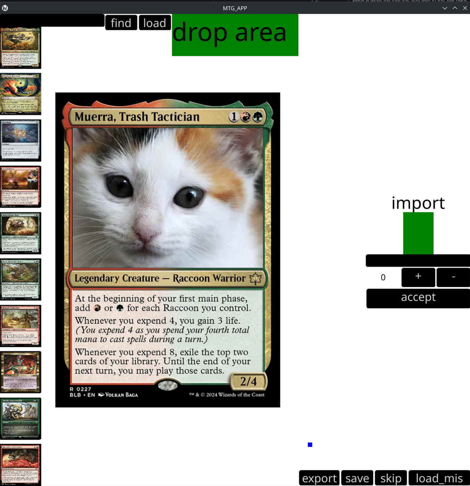

# mtg tool

***
demo: https://youtu.be/mxpGiXnvjhE 
i made this simple tool to make bulk custom mtg cards 
this is my first time i have ever used qml and c++ i was quite the learning experience
***
## how to use
* add a deck list
  * paist a deck list into the text box in the top right
  * a deck list needs a number and a name of the card 
  * example is below
* click find
  * this will look through all the cards in the database
  * after its done it should remove evreyting in the text box
* click load
  * this will load all the cards that it found during the previuse serch then load them on the side
* custimze your pictures
  * select a card
    * click any of the cards on the left side
  * add a picture
    * drag and drop a picture into the green drop area
    * it can be a file or it can be a link to a picture off the web
    * it only suports .png and .jpg
  * edit picture
    * at the start it will be a weird aspect ratio you need to drag it around a bit to fix that
    * you can use the blue square to scale the img
    * you can drag the picture around
  * save
    * you need to save before clicking off the card then it will save 
  * skip 
    * some cards wont work becaouise the picture has a different aspect ratio
* finded mised
  * so you can click load_mis
  * this will add all skiped cards and cards in the deck list the were in an invalid format
  * this isnet requared but if you skip a card you can still make it in like photoshop then import it in to the batch export
  * import
    * to import somthing into the export you need to drag a picture in to the import section
    * then you give the card a name
    * then use the + and - buttons to chose how many of those cards you want
    * then click the button to add it, it wil then add the card to a list underneeth so you can see what imports you have done
* export
  * once you are done with all the cards you can click export
  * there is a bug so you NEED to full screen becouse the buttons are too far down so you cant see them at the normal aspect ratio
  * then you click load first it will pull up 9 cards from the back of the list
  * then click export it will save those 9 cards as a picture in the output folder
  * you click load after that it will pull up the next 9 then you export 
  * repete till all are done then you can print those images then cut them to have all your cards
# deck list example
***
[COMMANDER] 
1 Muerra, Trash Tactician 
 
[COST 1] 
1 Celestial Reunion 
1 Sol Ring 
1 Vandalblast 
 
[COST 2] 
1 Bakersbane Duo 
1 Bark-Knuckle Boxer 
1 Brazen Collector 
1 Goblin Anarchomancer 
1 Heroic Intervention 
1 Hoarder's Overflow 
1 Keen-Eyed Curator 
1 Lightning Greaves 
1 Masked Vandal 
1 Metallic Mimic 
1 Peerless Recycling 
1 Raccoon Rallier 
1 Steely Resolve 
1 Take Out the Trash 
1 Trailtracker Scout 
1 Wandertale Mentor 
 
[COST 3] 
1 Adaptive Automaton 
1 Barkform Harvester 
1 Beast Within 
1 Bloodline Pretender 
1 Brambleguard Veteran 
1 Byway Barterer 
1 Chomping Changeling 
1 Coati Scavenger 
1 For the Ancestors 
1 Herald's Horn 
1 Patchwork Banner 
1 Prosperous Bandit 
1 Realmwalker 
1 Roughshod Duo 
1 Scrapshooter 
1 Sylvan Scavenging 
1 Taurean Mauler 
1 Valley Flamecaller 
 
[COST 4] 
1 Big Score 
1 Chameleon Colossus 
1 Decimate 
1 Gathering Stone 
1 Maskwood Nexus 
1 Molten Echoes 
1 Roaming Throne 
1 Roar of the Crowd 
1 Rust-Shield Rampager 
1 Scrappy Bruiser 
1 Teapot Slinger 
 
[COST 5] 
1 Banner of Kinship 
1 Collective Inferno 
1 Escape to the Wilds 
1 Junkblade Bruiser 
1 Return of the Wildspeaker 
1 Vanquisher's Banner 
 
[COST 6] 
1 Argivian Avenger 
 
[COST 7+] 
1 Blasphemous Act 
 
[LANDS] 
1 Cavern of Souls 
1 Cinder Glade 
1 Command Tower 
1 Copperline Gorge 
15 Forest 
1 Game Trail 
1 Kessig Wolf Run 
15 Mountain 
1 Oakhollow Village 
1 Path of Ancestry 
1 Rockface Village 
1 Rockfall Vale 
1 Rootbound Crag 
1 Stomping Ground 
1 Three Tree City 
 
 
// TOKENS 
Copy (C) 
Food (C) 
Treasure (C) 
3/3 - Beast (G) 
3/3 - Raccoon (G) 
1/1 - Rust-Shield Rampager (G) 
1/1 - Prosperous Bandit (R) 
2/2 - Shapeshifter (U) 